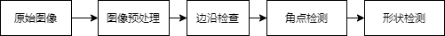
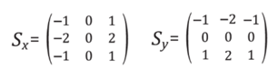
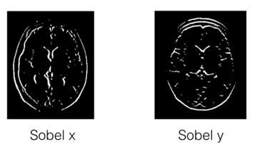
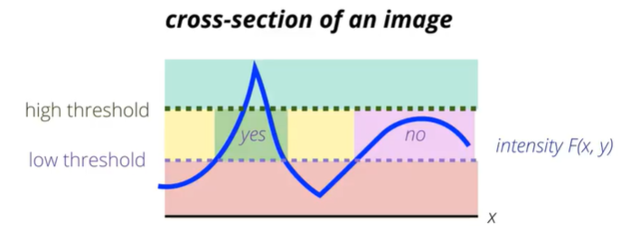
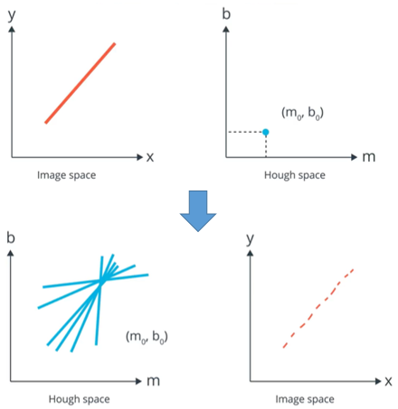
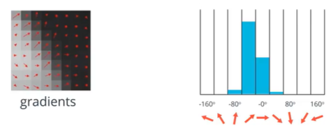
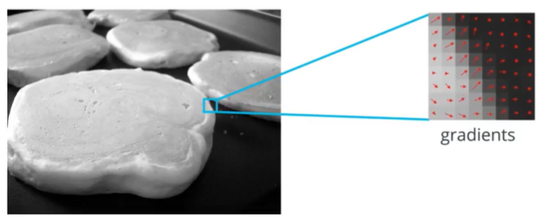
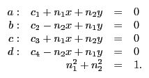
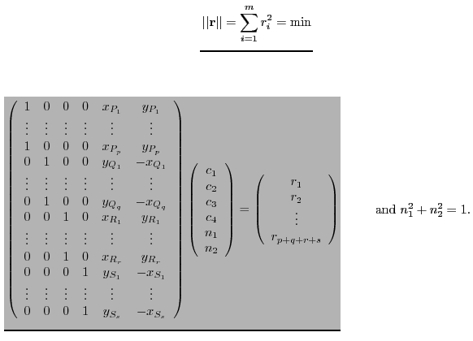
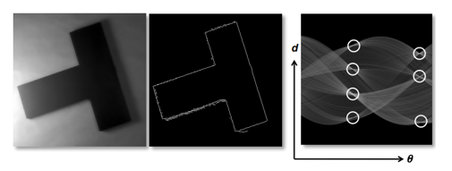

# 车位识别中的计算机视觉
以车位识别为例介绍CV中经典算法

## 架构
架构设计图。主要分为图像预处理，边沿检测，直线检测，角点识别，及车位拟合

## kernel(核函数)
核函数的作用相当于一个filter。可以作提取特征用。通过计算核心函数与原图的卷积，提取图像的某些特征。

## 低通滤波
低通滤波图片模糊处理。在边沿检测前先做模糊处理以减少噪声。常用高斯滤波进行模糊处理。高斯滤波的核函数如下：

## 高通滤波
高通滤波边沿检测。
通过梯度来描述图像强度的变化。通常梯度变化大的位置对应图像边沿部分。Sobel滤波用于边沿检测。可以通过核函数的设置检测不同方向的线段。下图sobel_x和sobel_y分别检测横向和纵向的线段。

 
### 边沿检测canny
canny通过双阈值法噪音和弱边沿。例如在opencv的Canny函数可设置参数，
'edges = cv.Canny(img,lower_threshold, upper_threshold)'

## 直线检测
Hough变换线段检测。平面空间的线在HOG变换后变为hough空间中的点。平面空间的点变为hough空间的线.

## 角点检测
HOG(histogram of gradient)梯度直方图提取图像的形状特征。HOG步骤如下：
1. 计算每个像素的梯度的大小和方向
2. 将这些像素分组为方形单元
3. 计算每个单元格在某个方向范围内落下的梯度数
将图像转成HOG特征后用机器学习(如SVM)的方法进行分类

## 形状检测
通过形状检测
1.在直角坐标系下通过最小二乘法拟合
2.在Hough空间拟合

